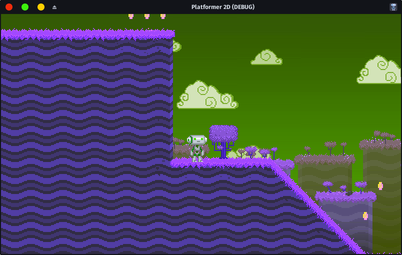

# ColorblindnessCorrection node

A plugin which add a CanvasLayer which better contrast colors for colorblindness.

Supports:
- Protanopia
- Deuteranopia
- Tritanopia

Mixed up version of [paulloz/godot-colorblindness](https://github.com/paulloz/godot-colorblindness) and [Colorblindness correction shader](https://godotshaders.com/shader/colorblindness-correction-shader/)

# Screenshots

# Usage

1 - Put the ColorblindnessCorrection node to tree  
2 - Select type  
3 - Enjoy

# License

[GPLv3](LICENSE)